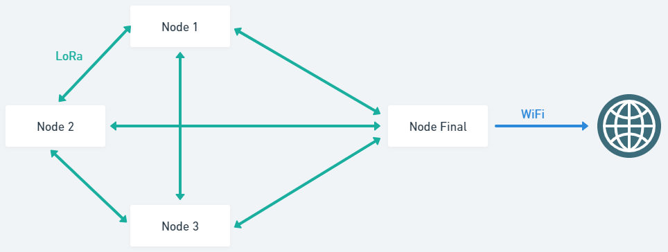
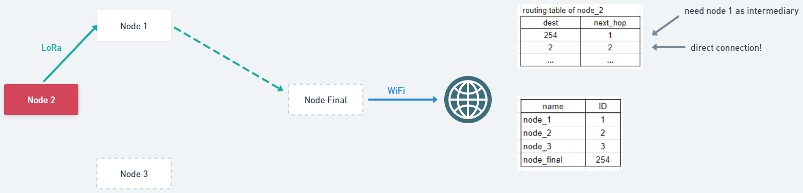

# LoRa RHMesh

> This repository is a place in which I include all projects for LoRa RHMesh development for my thesis. I provide all projects within the `projects` folder. All development are made by myself, yet it is made based upon many different projects scattered all over the internet.
>
> I develop mainly on an ESP32 board, connected with a RFM95 LoRa Chip. It transmits on 915 MHz. I develop on 2 environments, Arduino IDE, Platform IO VSCode Plugin.
>
> Feel free to use them, and contact me if you will!

This example sketch shows how to create a simple addressed, routed reliable messaging client with the RHMesh class. It is designed to work with the other examples rf95_mesh_server

### Getting Started
- Open VSCode, install PlatformIO
- Make sure you have the wiring correct!
- Change the current nodes ID and target node ID (to send message to) using the line
```
#define SELF_ADDRESS NODE3_ADDRESS
#define TARGET_ADDRESS FINAL_ADDRESS
```
- You can simulate other network topologies by setting the `RH_TEST_NETWORK` define your topology in RHRouter.cpp. read more in [Forced Topology section](#forced-topology)

### Wiring
```
[RFM95] ------------- [ESP32]
RESET  -------------- GPIO14
NSS/CS -------------- GPIO5
SCK    -------------- GPIO18
MOSI   -------------- GPIO23
MISO   -------------- GPIO19
DIO0   -------------- GPIO2

3.3V   -------------- 3.3V
GND    -------------- GND
```

if you have a different wiring scheme, don't forget to change these lines in main.cpp
```
#define RFM95_CS 5
#define RFM95_RST 14
#define RFM95_INT 2
```

### Topology


This example of a 4 node topology, in which the `FINAL_ADDRESS` node is expected to be the last node in the network, simulating a common topology in which this last node would act as a border node connected to the internet, collecting messages from other nodes during it's lifetime, then sending them to cloud. node 1-3 would collect sensor data then send to final node, and in the process node 1-3 could be an intermediary node for one another. Feel free to make a totally different addressing scheme.
```
#define NODE1_ADDRESS 1
#define NODE2_ADDRESS 2
#define NODE3_ADDRESS 3
#define FINAL_ADDRESS 254 // purposefully using the last namber
```

You can actively change the current nodes behaviour by changing this line. Make sure you change it for every different node!
```
const uint8_t selfAddress_ = NODE3_ADDRESS;
const uint8_t targetAddress_ = FINAL_ADDRESS;
```



after a route is discovered for a target node, it will be saved as a route entry of its routing table within that individual node. by saving the next direct node that is expected to be able connect it with the target node, even as intermediary. So in this example, `node 2` only saves `node 1` in it's route entry to connect with `node final`, not knowing whether `node 1` is the only intermediary node, or might there be more. hence, `node 1` is expected to have a route to connect with `node final`, in this example it will be a direct connection. `node 2` does not have a direct route to `node final`, nor `node 3` (because it only sends sensor data to `node final`)


## Misc
### Configuring The LoRa Module
Change to 915.0, 434.0 or other frequency, must match LoRa chip/RX's freq!
```
#define RF95_FREQ 915.0
```

By using Mesh, it has much greater memory requirements than just RH or RHRouter, and you may need to limit the max message length (characters) to prevent wierd crashes. Though you can change and experiment with message lengths by changing this
```
#define RH_MESH_MAX_MESSAGE_LEN 50
```

You can add specific LoRa modes for the RFM95 module by editting the `rhSetup()`. Defaults after init (without any explicit `.set`) are 434.0MHz, 0.05MHz AFC pull-in, modulation FSK_Rb2_4Fd36.
```
RHDriver.setTxPower(23, false);
RHDriver.setFrequency(RF95_FREQ);
RHDriver.setCADTimeout(500);
```

<a name="forced-topology"></a>
### Forced Topology

Even though this very project runs on RHMesh, which would expect the user to have a fully dynamic and fluid topology, you can force the routes/topology. it requires a little bit of hardcoding, you can inspect the code in RHRouter.cpp (line 223-263). It already has some premade topology examples that forces routing a certain way (it does this by dropping/not processing messages that does not comply the path), and the macro `RH_TEST_NETWORK` needs to be defined (before calling #include "RHMesh.h") to activate this forced topology. you can ofcourse add your own code that resembles your desired topology.
```
...
#ifdef RH_TEST_NETWORK
	if (
#if RH_TEST_NETWORK==1
	    // This network looks like 1-2-3-4
	       (_thisAddress == 1 && _from == 2)
	    || (_thisAddress == 2 && (_from == 1 || _from == 3))
	    || (_thisAddress == 3 && (_from == 2 || _from == 4))
	    || (_thisAddress == 4 && _from == 3)
	    
#elif RH_TEST_NETWORK==2
	       // This network looks like 1-2-4
	       //                         | | |
	       //                         --3--
	       (_thisAddress == 1 && (_from == 2 || _from == 3))
	    ||  _thisAddress == 2
	    ||  _thisAddress == 3
	    || (_thisAddress == 4 && (_from == 2 || _from == 3))
...
```

### How the Send/Receive Works in RadioHead	Mesh
We will send a message to another rhmesh node using this code, a route to the destination will be automatically discovered (this discovery function is the main point of using RHMesh, it automaticall generates a routing table for this node).
```
if (RHMeshManager.sendtoWait(reinterpret_cast<uint8_t *>(&msgSend[0]), msgSend.size(), TARGET_ADDRESS) == RH_ROUTER_ERROR_NONE) {
...
```
After that line, a return of `true` means we have been reliably delivered the message to the next node, and the next node has sent us an 'ACK'. If after a certain time there are no ACK, the sendtoWait will return a `false`. An important note is, the ACK is not from the target node, but anynode that has successfully received our node (other than the target node, is an intermediary node). Currently RHMesh does not tell if a message has successfully been received to the 'final' assigned target node. A way around this is by simply adding a logic to the 'final' target node to send a message to the 'initial' sender node after it received a message, as an artificial ACK.

Now to add another logic, we wait for a message from another node, hold activities until a message arrives, or timeout reached. this particular code is NOT part of the ACK system to make sure sendtoWait has been reliably sent, this is an entirely new process.
```
if (RHMeshManager.recvfromAckTimeout(_msgRcvBuf, (uint8_t *) sizeof(_msgRcvBuf), 3000, &_msgFrom)) {
...
```

### Naming Style
```
localVariable_
_tempVariable
globalVariable
```