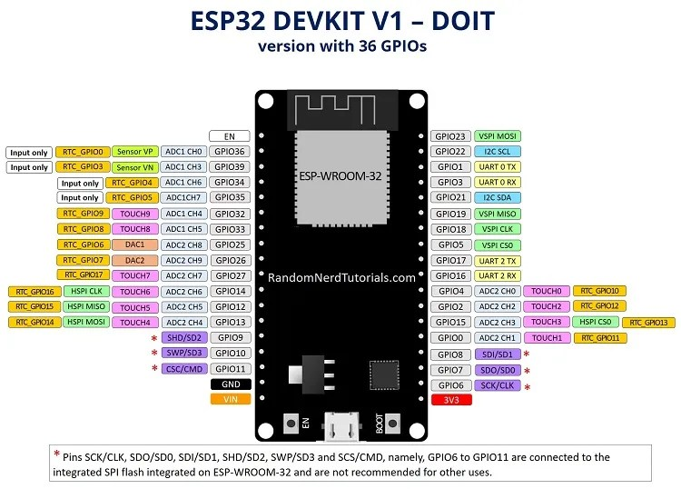
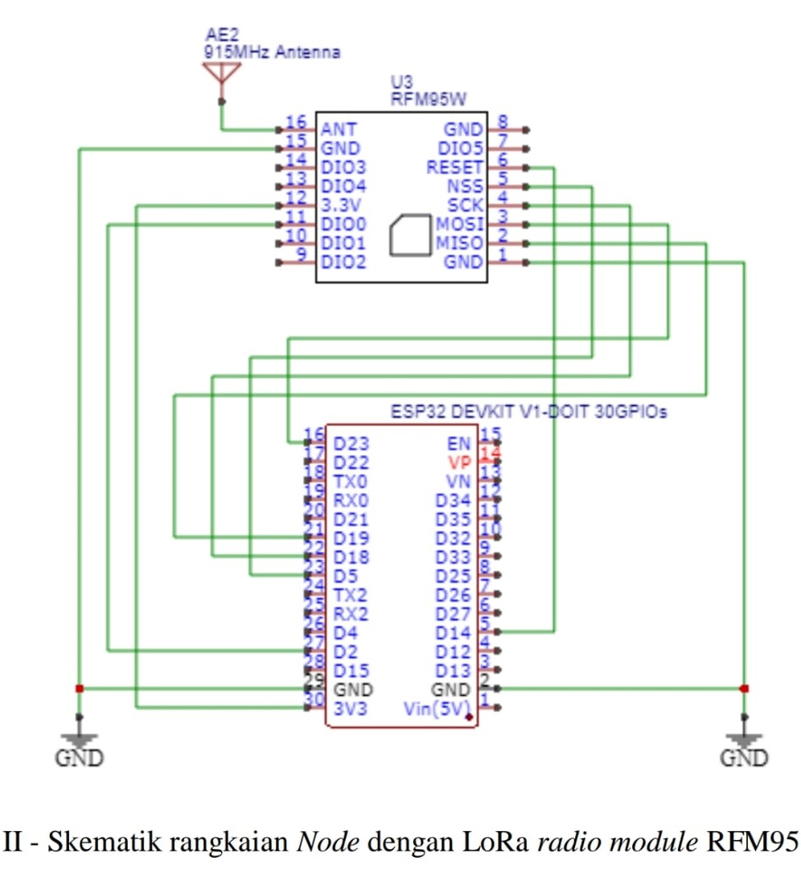
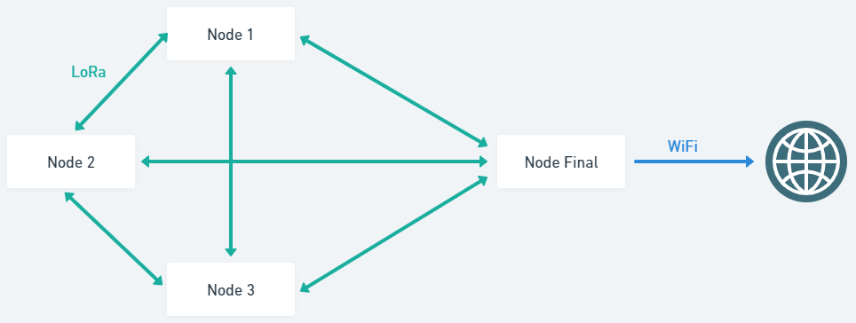
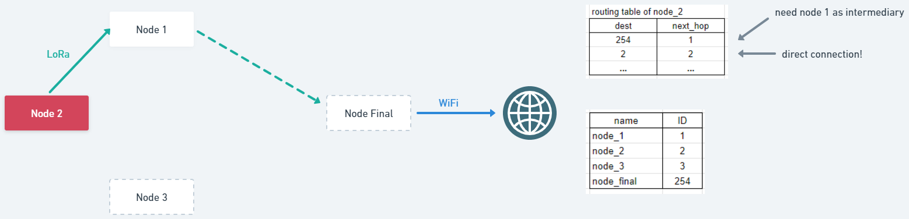

# LoRa RHMesh

[](https://github.com/royyandzakiy/LoRa-RHMesh/actions/workflows/ci.yml)

A small, readable LoRa mesh network for ESP32 + RFM95, built on the [RadioHead](http://www.airspayce.com/mikem/arduino/RadioHead/) `RHMesh` class. Nodes find routes to each other on their own and forward messages over several hops, and every message gets an end-to-end delivery confirmation.

You can run the whole mesh **on your PC without any radios** in the simulator, then flash the same code to real boards.

> This started as the code for my thesis. The original sketches are kept in the [`v0-thesis`](https://github.com/royyandzakiy/LoRa-RHMesh/tree/v0-thesis) tag. Since then it has been cleaned up, its bugs fixed, and a simulator and CI added. Feel free to use it, and contact me if you want!

- [Try it without hardware](#try-it-without-hardware)
- [Run it on boards](#run-it-on-boards)
- [How RHMesh routes](#how-rhmesh-routes)
- [Examples](#examples)
- [Configuration](#configuration)
- [Repository layout](#repository-layout)

## Try it without hardware

Install [PlatformIO](https://platformio.org/install) (the VS Code extension or the CLI) and a host C++ compiler: g++ on Linux or WSL, Xcode tools on macOS, or [MSYS2](https://www.msys2.org/) g++ on Windows. Then:

```bash
pio run -e sim-demo -t exec
```

This runs four simulated nodes in the line `3 - 2 - 1 - 254`, where each node only hears its neighbours. Nodes 1-3 send to the end node 254:

```
[node   3] sending "Hello from node 3 #0" to 254...
[node 254] from 3: "Hello from node 3 #0" rssi -70, 2 hop(s)
[node   3] delivered (next hop 2)
```

Node 3 can't reach 254 directly, so RHMesh discovers the route through 2 and 1. At the end the demo powers off node 1 to show what a broken route looks like. Add `-a --trace` to print every frame on the air.

The tests run the same way:

```bash
pio test -e native
```

They cover routing over several hops, rerouting around a dead node, lossy links, payload limits and the end-to-end ACK. To try your own topology, look at [`test/test_mesh/test_mesh.cpp`](test/test_mesh/test_mesh.cpp): `SimEther` sets which nodes hear each other (`link`, `setDropRate`, `setPowered`), and `SimNode` is one simulated board.

The simulator models routing, not radio physics: there are no collisions, and every frame on a link arrives cleanly unless you add loss.

## Run it on boards

### Hardware
ESP32 boards with an RFM95 LoRa module, at least two. The envs are set up for the ESP32 DOIT devkit with a separate RFM95, and for the TTGO T-Beam, which has the radio on board. Check that the frequency matches your module and your region (`RF95_FREQ`, default 915 MHz).

### Wiring
```
[RFM95] ------------- [ESP32]
RESET  -------------- GPIO14
NSS/CS -------------- GPIO5
SCK    -------------- GPIO18
MOSI   -------------- GPIO23
MISO   -------------- GPIO19
DIO0   -------------- GPIO2

3.3V   -------------- 3.3V
GND    -------------- GND
```
<details>
<summary>Schematic</summary>

<br/>


</details>

With different wiring or another board, add a `[board-...]` section with your own `pin_flags` in [`platformio.ini`](platformio.ini).

### Flash two nodes
Each node is a PlatformIO env that sets its address with build flags. Set `monitor_port`/`upload_port` in `platformio.ini` to your COM ports (or remove them to auto-detect), then:

```bash
pio run -e node-id-1 -e node-id-254 -t upload
```

Node 1 sends to the end node 254 every 3 seconds, and node 254 replies with an end-to-end ACK. In node 1's serial monitor you should see `delivered (next hop 254)`.

### Force a multi-hop route on your desk
On a desk every node hears every other node, so the mesh never needs more than one hop. The `testnet-node-1/2/3` envs set `RH_TEST_NETWORK=4`, which makes RadioHead drop frames so the nodes form the line `1 - 2 - 3`:

```bash
pio run -e testnet-node-1 -e testnet-node-2 -e testnet-node-3 -t upload
```

Node 1 should now print `delivered (next hop 2)`, and node 3 should log the message with 1 hop. `RH_TEST_NETWORK` has to be a build flag, because RadioHead reads it when `RHRouter.cpp` is compiled. A `#define` in `main.cpp` has no effect.

## How RHMesh routes



In this 4-node example, the final node (address 254 in the code) is the end node, for example a gateway that later forwards everything to the cloud. Nodes 1-3 send to it, and can also forward for each other.

> Don't use address 255 for a node. It's RadioHead's broadcast address: messages to it are sent one hop with no route and no ACK, and `sendtoWait` still reports success. The code refuses it at compile time.



When a node sends to an address it has no route for, RHMesh broadcasts a route request. Every node forwards it once and adds itself to the path, and the destination replies along that path. Each node on the way **only saves the next hop**, not the full path. In the picture, node 2 knows "to reach 254, send to node 1". It doesn't know whether node 1 is the last hop or there are more. Node 1 knows its own next hop, in this case 254 directly.

### Two kinds of ACK
- **Hop ACK** (RadioHead): `sendtoWait` returns success as soon as the *next hop* acknowledges. That doesn't mean the destination got it.
- **End-to-end ACK** (`MeshNode`): the destination sends a small ACK back to the original sender. `MeshNode::send()` waits for it, so its result tells you what actually happened:

| Result | Meaning |
|---|---|
| `delivered` | the destination confirmed it |
| `no end-to-end ACK` | the first hop took it, but it got lost further on, or the destination is down |
| `next hop did not ACK` | the next hop is off the air or out of range |
| `no route` | route discovery found no path |

Receiving goes through `MeshNode::poll()`, which also forwards messages for other nodes, so every node has to keep calling it.

## Examples

| Code | Envs | What it shows |
|---|---|---|
| [`src/main.cpp`](src/main.cpp) | `node-id-*`, `testnet-node-*`, `longrange-node-*` | The mesh node: route discovery, multi-hop delivery, end-to-end ACK |
| [`examples/01-range-test`](examples/01-range-test/main.cpp) | `range-test-sender`, `range-test-receiver` | The radio alone, no mesh: RSSI, SNR, packet loss and time on air for a modem setting |
| [`examples/02-static-routing`](examples/02-static-routing/main.cpp) | `static-routing-node-1/2/3` | `RHRouter` with routes written by hand, to compare with RHMesh finding them |
| [`sim/demo.cpp`](sim/demo.cpp) | `sim-demo` | The mesh on simulated radios |

## Configuration

Build flags, set per env in `platformio.ini`:

| Flag | Default | |
|---|---|---|
| `SELF_ADDRESS`, `TARGET_ADDRESS` | 3, 254 | This node and where it sends, 0-254 |
| `ENDNODE_ADDRESS` | 254 | The node that only listens and replies |
| `RF95_FREQ` | 915.0 | Must match the module and every other node |
| `MODEM_CONFIG` | RadioHead default (`Bw125Cr45Sf128`) | One of `RH_RF95::ModemConfigChoice`, the same on every node |
| `SEND_INTERVAL_MS` | 3000 | |
| `HOP_TIMEOUT_MS` | 200 | Per-hop ACK wait, must cover a frame and its ACK on air |
| `ACK_TIMEOUT_MS` | 3000 | End-to-end ACK wait, must cover every hop there and back |
| `RH_MESH_ARP_TIMEOUT` | 4000 | Route discovery wait |
| `WDT_TIMEOUT_S` | 15 | Longer than the slowest send, or the watchdog resets mid-send |
| `RH_TEST_NETWORK` | off | Forced topology, see [above](#force-a-multi-hop-route-on-your-desk) |

**Long range.** Slower modem settings reach further but take much longer on air: at SF12 (`Bw125Cr48Sf4096`) one short message takes about 3 s, so every timeout above has to grow with it. The `longrange-node-1/254` envs have a starting set. The values are calculated from time on air, not measured yet, so tune them on your hardware. Use `examples/01-range-test` to compare modem settings first.

**Message size.** `MeshNode::maxPayload()` is 243 bytes on the RFM95 (251 bytes per frame, minus the mesh headers).

## Repository layout

```
src/main.cpp          ESP32 mesh node
lib/MeshNode/         Mesh layer: end-to-end ACK, bounded send/receive (no Arduino code)
lib/MeshSim/          Simulated radios for running MeshNode on a PC
lib/BoardConfig/      Pins, frequency and radio reset shared by src/ and examples/
lib/RadioHead/        RadioHead 1.120 with a few fixes, see PATCHES.md
examples/             Range test and static routing
sim/demo.cpp          Simulator demo
test/test_mesh/       Simulator tests
```

RadioHead is vendored instead of installed, because it needs small fixes, listed in [`lib/RadioHead/PATCHES.md`](lib/RadioHead/PATCHES.md). Known issues are in [`BUGS.md`](BUGS.md), and the plan behind the cleanup is in [`PLAN.md`](PLAN.md).

The ESP32 platform is pinned to `espressif32@6.10.0` (Arduino core 2.0.x), because RadioHead 1.120 doesn't compile with core 3.x.
